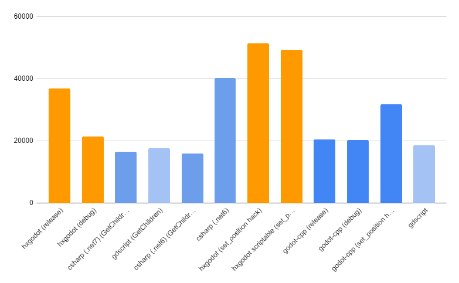

# HxGodot BunnymarkV2 for Godot 4

Renders an increasing number of bunny sprites until a stable 60fps is hit. This is a decent test of real world usage as it combines Godot api usage with raw computation. Feel free to contribute language implementations or improvements!

For each run, the benchmark will create a new report in the `reports` folder.

I'm aggregating my reports [in a google sheet here](https://docs.google.com/spreadsheets/d/1DnEdHcOCv5znKHPEK5vSRZpaGyOuhUPLuldATTb0484/edit?usp=sharing).



## Disclaimer

The performance differences here might appear significant, but these benchmarks test the limits of each language (and the engine), which most games will never hit. Do not pick a language because it is "fastest" unless you know you need the fastest language. The smarter choice would be to pick the language you are most productive in. I personally think that most people will be more productive in GDScript or C#. A lot of time and energy went into making GDScript an integrated, seamless experience so it is a good starting point if you don't have a preference for any of the other languages listed.

It is also important to note that C#/Mono and GDNative are both very young. Its possible that their performance characteristics will change. And please don't use these benchmarks to say "Language X is better / faster than Language Y", we don't have enough data to make those assertions. If anything this proves that any of the choices below are viable. Choose the language that you are comfortable with and do your own testing to cover your own scenarios.

## building & running

### gdscript

Open the project in Godot Editor at least once to import everything

```
<path to your godot executable> --lang=csharp
```

### csharp

Open the project in Godot Editor and build the csharp code at least once. Have either `.net6` or `.net7` SDK installed.

```
<path to your godot executable with C# support> --lang=csharp
```

### hxgodot

Setup and build the hxgodot extension
```
haxelib git hxgodot https://github.com/HxGodot/hxgodot.git
haxelib run hxgodot generate_bindings -y
scons platform=<windows|linux|macos> target=<debug|release>
```

```
<path to your godot executable> --lang=hxgodot
```


## Credits

* [@cart](https://github.com/cart) This repo is based on [@cart_cart](https://twitter.com/cart_cart)'s https://github.com/cart/godot3-bunnymark
* GDScript example adapted from: https://github.com/curly-brace/godot-bunnies.  Thanks [@curly-brace](https://github.com/curly-brace)!
* [@Capital-EX](https://github.com/Capital-EX) provided the initial Nim tests, the D tests, and the display server tests
* [@endragor](https://github.com/endragor) updated the GDNative tests to work with Godot 3.0 stable
* [@Geequlim](https://github.com/Geequlim) added ECMAScript tests
